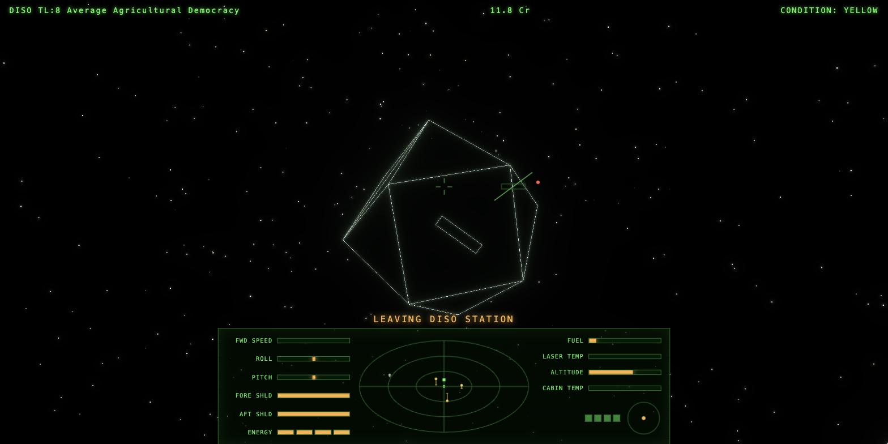
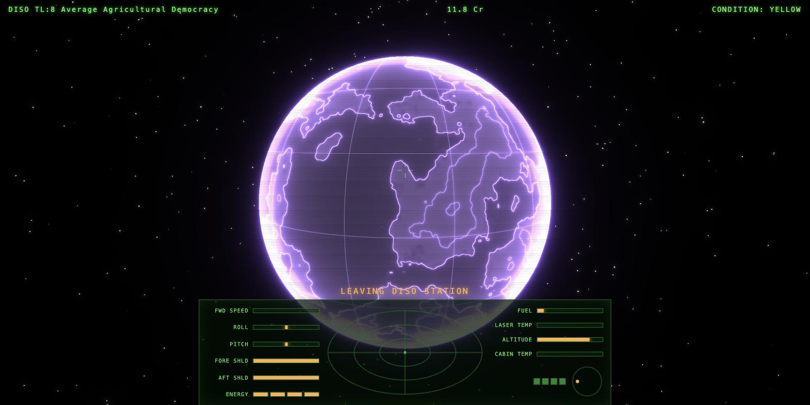
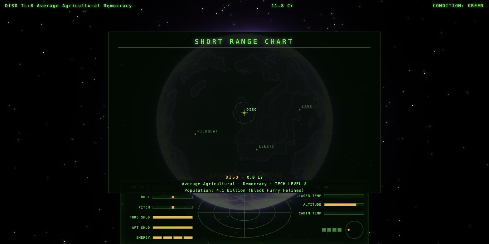
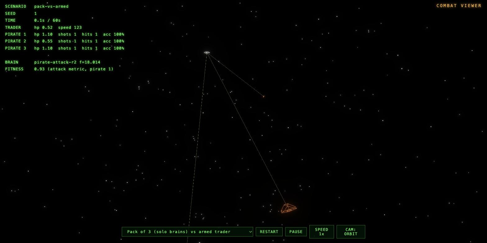

# HARMLESS

*An unofficial browser tribute to **Elite** (1984) by David Braben and Ian
Bell. Harmless is the combat rating you start at; the ladder ends at
E L I T E.*

Authentic wireframe ships, the
original byte-accurate procedural galaxy (Lave is system 7, as it should
be), modern shader-driven suns and planets — and ship AI trained by
neuroevolution self-play, flying both the pirates that hunt you and the
traders that fight back.



| | |
| --- | --- |
|  |  |

*Every planet is generated from the 1984 seeds — Diso's violet coastlines
above, "Population: 4.1 Billion (Black Furry Felines)", exactly as the
original's data tables intend. Below: three trained pirates converging in
the [combat viewer](docs/TRAINING-LOG.md).*



**Docs index:**
[Development log](docs/DEVLOG.md) ·
[Architecture tour](docs/ARCHITECTURE.md) ·
[AI design](docs/AI-TRAINING.md) ·
[Training runs & results](docs/TRAINING-LOG.md) ·
[Reproducing the training](train/README.md) ·
[Gap analysis vs the 1984 original](docs/GAP-ANALYSIS.md) ·
[The Jameson Trials](docs/JAMESON-TRIALS.md)

## Run

```sh
npm install
npm run dev     # http://localhost:5173         (landing page)
                # http://localhost:5173/play    (the game)
                # http://localhost:5173/viewer  (AI combat viewer)
                # /manual · /novella            (manual and story)
npm run build   # lint + tests (via prebuild), then production build to dist/
npm run train -- attack --gens 400   # retrain the pirate AI (Node ≥ 22.6; see train/README.md)
npm run evaluate                     # held-out tournament for the current brains
npm test                             # invariant + simulation tests (no framework)
npm run campaign                     # headless balance playtest: 40 careers × 60 legs
npm run campaign -- 4 45000 all      # three career strategies, all the way to E L I T E

# inhabitant portraits (offline; images are committed, nothing runs in the browser)
node --experimental-strip-types tools/species-prompts.ts 1 --style crt --json > /tmp/g1.json
                                     # styles: crt, lit, ink, plain — the model does the look
uv run tools/generate-species.py /tmp/g1.json --repo ../ultra-fast-image-gen --only Lave,Diso
                                     # ^ starts that repo's server.py and keeps the model resident
uv run tools/posterise.py --size 256 --tones 6        # re-crush, no GPU needed
```

Two playtest harnesses back this up. `npm run campaign` plays hundreds of
full commander careers headlessly — real galaxy, market, living-galaxy and
contract code, with only flight abstracted — and reports whether the economy
actually works (wealth curve, bankruptcy rate, time to first upgrade,
equipment progression, piracy losses), failing the build if it doesn't. It
can also play a commander all the way to **E L I T E** (25,600 kills) in
about 20 seconds, under three different strategies — `trader`, `hunter`,
`privateer` — which is how the combat ladder below was measured.

The docked **combat trainer** (`T` at any station) replaced three console
harnesses. It logs a fight you actually flew — your accuracy and theirs,
damage by source, the geometry that decides whether an NPC can shoot at all,
and how you fly — and exports it as JSON. Scenarios are repeatable from a
seed, so the same fight can be flown against two different brains and
compared.

It exists because every bot-flown measurement in this project turned out to be
shaped by the bot: flying straight flatters one kind of AI, flying the defence
policy flatters another. `npm run survivability` is still the bot answer to
"can I survive a gang?"; the trainer's **waves** mode is the human one.

There's also an **autonomous playtest agent** (`test/playtest.js`): paste it
into the browser console with the game open and `await __playtest.run({
legs: 8 })` sends a commander off to take contracts, trade, fight, jump and
dock on its own, asserting invariants as it goes and printing a report of
everything it exercised. It's how gameplay changes get regression-tested.

CI lints, tests, builds and runs the balance playtest on every push. The
live site deploys from Cloudflare Pages (build `npm run build`, output
`dist`) — and since npm runs `prebuild` before `build`, a commit that fails
lint or tests fails the deploy build rather than shipping.

> Retraining overwrites the committed neural weights in `src/ai-training/brains/`
> that the game imports — `git checkout src/ai-training/brains` restores them.

You start docked at Lave Station with 100.0 Cr, a full tank and 3 missiles.
Progress saves automatically when you dock, and the whole world — your ship,
your cargo, every NPC in the sky — autosaves every 20 seconds in flight. Close
the tab mid-fight and you resume where you left off.

## New to Elite?

There is a **[Space Trader's Flight Training Manual](https://harmless.atomic14.com/manual)** — how to
trade, jump, dock and survive, with a first run worked out against the game's
own market model — and **[The Long Way Out](https://harmless.atomic14.com/novella)**, an original
novella with papers from the eight galaxies.

In-game, **H** at the station opens a six-page new pilot's briefing, and **?**
shows the controls at any time.

## Controls

Two flight layouts ship. **CLASSIC — the authentic 1984 keys — is the
default**; press **B** when docked to switch to MODERN (WASD), which is
remembered per browser. Press **?** any time for the in-game guide, which
always shows the active layout.

### Flight

| CLASSIC (default) | MODERN | Action |
| --- | --- | --- |
| S / X | W / S | dive / climb — pitch (in both: ↓ arrow pulls up) |
| `,` / `.` | A / D | roll (arrows work in both) |
| SPACE | SPACE | accelerate |
| `/` | X or `/` | decelerate |
| A (or F) | F | fire laser (watch the temperature) |

The original's `<` `>` roll and `/` slow-down are live in both layouts, so
muscle memory from 1984 mostly survives either choice. Arrow keys always fly.

**Mouse flight**: press **V** in flight to pointer-lock the mouse into a
self-centring analogue stick (left button fires). Touching the keyboard
overrides it; ESC or V releases. This is the closest thing to the
joystick the original supported.

### Commands (identical in both layouts)

| Key | Action |
| --- | --- |
| 1 2 3 4 | front / rear / left / right view |
| T / M / U | arm missile (locks in your sights) / fire / unarm |
| E / TAB | E.C.M. / energy bomb (if fitted) |
| J | torus jump drive (8×, stars streak; cuts out when mass-locked) |
| C | docking computer — flies you in; press again or touch the controls to take over |
| K | combat computer — the trained defence AI flies your ship (if fitted) |
| N / G | short range chart / galactic chart |
| H / ⇧H | hyperspace jump / galactic hyperdrive (if fitted) |
| B | distress beacon — GalCop tows you out of witch-space, for your cargo |
| Y | jettison a tonne of cargo — pirates came for the goods, not for you |
| I | commander status |
| P | pause |
| V | mouse flight — pointer-locked analogue stick, left button fires |
| ? | controls guide |

Views on 1-4 (the original used F0-F3) and screens on letters (were F4-F9),
because browsers claim the function keys.

### Docked

| Key | Action |
| --- | --- |
| L | launch |
| M / C / E | market · contracts · equip ship |
| N / G / D / I | local chart · galactic chart · data on system · status |
| **T** | **combat training simulator** — practise a fight; nothing in it reaches your career |
| H | new pilot's briefing |
| B | switch keyboard layout |
| S | commander file (4 save slots · rename) |
| X / Z | export · import save |
| Q | start a new commander (confirms first) |

↑↓ and ENTER work on the menu as well as the letter keys.

### Combat training simulator

Free, at every station, on **T**. Pick a mode (one scored fight · endless
sparring against one hull · escalating waves), a scenario, a threat tier, an
optional seed, and optionally build the opposition yourself — hull, count,
tier, brain and fit, per group — plus a fit-out override for your own ship.
ENTER launches; **ESC** or **Q** ends the exercise.

It is the real game: real flight model, real trained brains, real guns. But
**nothing that happens in it leaves it** — no kills, no combat rating, no
credits, no legal status, no save write, and death ends the exercise rather
than the career. Afterwards you get a report (accuracy both ways, damage by
source, engagement ranges, time on each other's six, your own flight
envelope) which exports as JSON to the clipboard or a file, and lands on
`window.__simLog` for a console session or an agent to read.

### Market

↑↓ select · B buy · V sell · ESC exit

### Charts

**Click a system to target it** · arrows move the cursor · ENTER set
hyperspace target · **D data on system** (the full statistics page with the
original's procedurally generated planet description) · M market estimate ·
F find a system by name · ESC exit

### Docking and the console

Fly into the station's docking port with your wings matched to its rotation.
An amber marker shows where the port is, with an arrow at the screen edge
when it's behind you; it turns green and reads DOCKING PORT — LINED UP when
you're on the axis and rolled to match. Get it wrong and you'll bounce off
with shield damage — or buy the docking computer.

In a fight, a red arrow at the screen edge points at the nearest hostile you
can't currently see.

The console lights an **S** while the station is in scanner range (its
defences cover you there) and an **E** when an E.C.M. broadcast is
detected — as on the original's dashboard.

## Game systems

- **Trading** — 17 commodities with the original price/quantity model;
  economies matter (buy food cheap at agriculturals, sell computers dear).
  20t hold; precious metals/gems don't take hold space.
- **Combat** — pulse/beam/military lasers with heat, four mounts, homing
  missiles you arm and then lock by putting the target in your sights,
  on-screen target brackets with a lead marker, hull hits that cost you
  cargo and fittings,
  fore/aft shields and 4 energy banks, bounties, kill ratings from Harmless
  to E L I T E. Pirate numbers scale with the government type; shoot police
  or traders and you become a fugitive (police attack; fine on docking).
- **Hyperspace** — 7.0 LY fuel range, per-jump fuel cost by real chart
  distance, 5-second countdown.
- **Death** — ship destroyed → reload your last save (unless an escape pod
  saves you, at the cost of your cargo). Because the world autosaves in
  flight, that is at most ~20 seconds back, not the last station.
- **Legal system** — CLEAN → OFFENDER → FUGITIVE; police scan for contraband
  (slaves, narcotics, firearms), bounty hunters stalk offenders, fines on
  docking.
- **A living system** — traders warp in, do business at the station and jump
  out; pirates hunt them for cargo you can scoop; police hunt the pirates.
- **Witch-space** — mis-jumps drop you among Thargoids and their Thargon
  drones. High bounties, if you live. Out of fuel out there? Broadcast a
  distress beacon and GalCop will tow you clear — they'll take your cargo
  as the salvage fee.
- **Mining & scooping** — blast asteroids (mining laser drops ore canisters)
  and scoop drifting cargo with fuel scoops; sun-skim to refuel, watching the
  cabin temperature.
- **A living galaxy** — trade runs between all 256 systems while you play.
  Convoys depart from productive worlds, get taken by pirates in lawless
  space, and arrive in your system as real ships. Prices drift with supply,
  pirate hotspots emerge along dangerous routes, and the system data screen
  reports the news. The 1984 economy stays the baseline underneath — this
  layer only ever nudges it ±25%.
- **Pirates as businesses** — what waits for you on the way in depends on
  what you're visibly worth. An empty Cobra draws a couple of opportunists in
  Sidewinders; a full hold draws professionals; a fat, notorious one draws an
  organised gang flying a coordinated attack policy. A gang isn't five
  Fer-de-Lances, though — it's two ringleaders plus hangers-on in whatever
  they could afford, which is why they can be common without being hopeless. Only
  what a pirate can *see* counts — cargo, hold size, fitted laser, your
  reputation — never your bank balance, so banking the money and flying clean
  is a real strategy. Threat grows far slower than your ship does, so upgrades
  are felt rather than cancelled out. And since they came for the cargo,
  **jettisoning it (Y) buys them off** — proportionally: opportunists want a
  little, a gang that organised for you wants about a third of the prize.
  Selling big or dirty loads raises your profile here and in neighbouring
  systems, and it fades if you lie low. Your **reputation cuts both ways**:
  it scares off thieves after easy cargo, but once you're Dangerous roughly a
  third of the ships waiting for you came for the name rather than the hold.
  Ratings count difficulty too — a gang's Fer-de-Lance is worth five
  Sidewinders — so the ladder rewards the fights worth having.
- **Contracts** — every station runs a bulletin board with cargo runs,
  courier jobs and pirate-clearing bounties, available from your very first
  landing. Deadlines are measured in days, which pass as you jump. (The
  original made you earn your first mission with 16 kills; a new commander
  deserves somewhere to be.)
- **Navy missions** — prove yourself (16+ kills, galaxy 1) for the
  Constrictor hunt and the classified courier run.
- **Don't shoot the station.** Its hull shrugs off a laser, but GalCop
  notices: you're marked an offender and the station scrambles Vipers from
  the slot. Shooting *those* is how you become a fugitive.
- **Encounters** — destroyed ships eject escape capsules (scoop one and the
  survivor becomes, regrettably, cargo); stations scramble Vipers if you
  misbehave in their sight; rock hermits hide among the asteroids, dealing
  ore and asking no questions; derelict generation ships drift between the
  stars; and someone will sell you a Trumble for 2 credits, which is one of
  the worst decisions available to you.
- **Trained ship AI** — pirates and armed traders fly neural policies
  trained by self-play (docs/TRAINING-LOG.md); watch them fight in the
  combat viewer.

## Architecture

- `src/galaxy/` — the genuine Elite galaxy algorithm: three twisted 16-bit
  seed words generate all 256 systems per galaxy (names, economy, government,
  tech level, market). Galaxy 1 is byte-identical to the original — system 7
  is Lave.
- `src/ships/` — all 38 released hulls as explicit vertex/edge/face tables in
  the style of the original BBC data, generated from the vendored reference
  pack. Thirty-one of them fly (Cobra Mk III and Mk I, Sidewinder, Viper,
  Adder, Krait, Mamba, Asp, Fer-de-Lance, Python, Anaconda, Boa, Gecko, Moray,
  Worm, Shuttle and Shuttle Mk II, Transporter, Dragon, Monitor, Ophidian,
  Ghavial, Bushmaster, Rattler, Iguana, Chameleon, Thargoid, Thargon,
  Constrictor, missile, canister); the Coriolis and Dodo stations are the same
  tables at a larger presentation scale. All drawn as wireframe edges over a
  black occluding hull (classic hidden-line look), and all browsable at
  `/viewer`.
- `src/world/` — shader sun (animated fbm surface, limb darkening, corona),
  shader planet (coastline contours, graticule, terminator, atmosphere rim —
  seeded per system), starfield, space dust, per-system scene assembly.
- `src/game/` — game orchestrator (modes, docking, hyperspace, combat),
  NPC AI (traders/pirates/police), commander state + saves.
- `src/hud/`, `src/ui/` — scanner/compass/gauges console and the full-page
  screens (station menu, market, chart, status).
- `src/audio.ts` — WebAudio synth in the spirit of the BBC sound chip,
  including the docking waltz. The Commodore 64 Elite played *An der schönen
  blauen Donau* while you docked; the tune is Strauss, 1866, and comfortably
  public domain, so it is synthesised here from note data rather than shipping
  audio from the original game — this repo contains no assets from Elite.
- `src/ai-training/` + `train/` — render-free combat simulator, tiny MLP policies
  (1.9k params, keyboard-style discrete actions) and a neuroevolution
  self-play trainer; trained weights live in `src/ai-training/brains/`. The combat
  viewer (`viewer.html`) replays matchups with the real wireframe ships.
  See `docs/AI-TRAINING.md` and `docs/TRAINING-LOG.md`.
- Rendering: three.js + UnrealBloom for the phosphor glow.

## Acknowledgements & legal

This is a non-commercial fan homage, released under the MIT license (see
LICENSE). Elite (1984) was created by Ian Bell and David Braben and published
by Acornsoft; the "Elite" trademark belongs to Frontier Developments plc.
This project is affiliated with none of them. The galaxy generator follows
the long-published descriptions of the original algorithm; ship silhouettes
are freshly-made approximations in the spirit of the originals.

## Roadmap

[docs/GAP-ANALYSIS.md](docs/GAP-ANALYSIS.md) tracks feature-by-feature parity
with the original manual, and almost all of it is implemented — including the
things this section used to list as outstanding: side laser mounts, mouse
flight, the two-level living galaxy, the purchasable combat computer, and pack
training (now at round 11).

Remaining: gamepad support, the last few hulls, and a decision on two combat
questions that are measured but not settled — whether organised gangs are too
weak (0 player deaths in 36 recorded fights), and whether the pack brain should
become their default.

One finding worth reading before touching combat AI, from
[docs/TRAINING-LOG.md](docs/TRAINING-LOG.md): pirates line up on a human player
about 5% of the time, and land 88% of the shots they do take. Doubling that 5%
kills the player. The balance rests on pursuit being imperfect, so "better"
pursuit is not automatically better.
